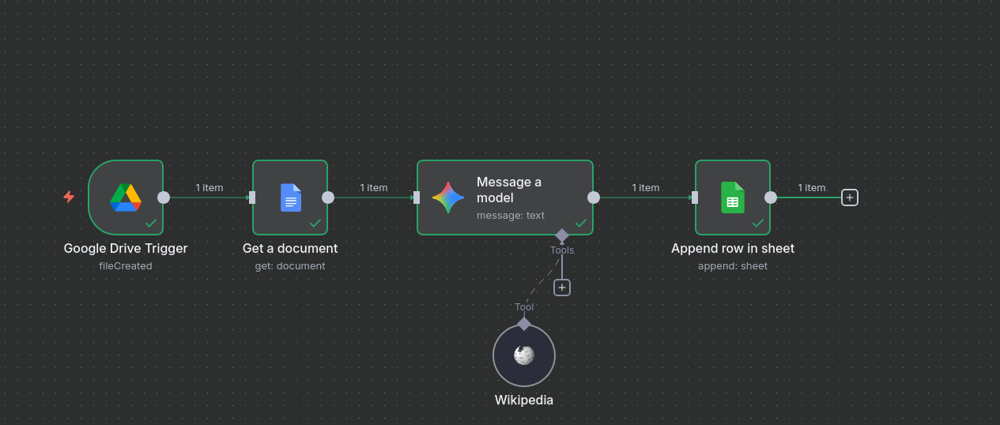

# ⚡ AI-Powered Document Analyzer

This **n8n** workflow automates the process of **analyzing new Google Docs** uploaded to Google Drive using an AI model and recording the results in a Google Sheet.  
It’s designed to streamline document processing and integrate intelligent text understanding into your automation pipeline.

---

## 🧠 Workflow Overview

### 1. **Google Drive Trigger**
The workflow is triggered whenever a new Google Document is created in a specific folder on Google Drive.

### 2. **Get a Document**
Retrieves the content of the newly added document, making it available for analysis.

### 3. **Message a Model**
Sends the document’s text to a **Generative AI model** for automated analysis.  
The AI can:
- summarize the content,  
- extract key insights or entities,  
- classify topics, or  
- generate additional context using the **Wikipedia** integration for reference.

### 4. **Append Row in Sheet**
The workflow then saves the results into a **Google Sheet**, creating a structured dataset that includes:
- document name,  
- AI-generated summary or analysis,  
- date/time processed.

---

## ⚙️ Integrations Used
- 🟩 **Google Drive** — triggers the workflow when a new document is added.  
- 📄 **Google Docs** — provides access to document content.  
- 🤖 **n8n AI Model Node** — processes and analyzes text using a connected LLM (e.g., OpenAI GPT).  
- 🌐 **Wikipedia Tool** — retrieves additional information or definitions for context.  
- 📊 **Google Sheets** — stores the processed results for future reference.

---

## 🚀 Benefits
- Automates repetitive document analysis tasks.  
- Combines AI reasoning with real-time data from Wikipedia.  
- Centralizes results in Google Sheets for easy reporting and follow-up.  
- Reduces manual review time for large volumes of documents.

---

## 📁 How to Use
1. Import the `AI-Powered-Document-Analyzer.json` file into your n8n instance.  
2. Configure credentials for:
   - Google Drive  
   - Google Docs  
   - Google Sheets  
   - AI Model (OpenAI or similar)  
3. Adjust the monitored folder path in the Google Drive Trigger node.  
4. Set the Google Sheet destination for data logging.  
5. Activate and test by uploading a new Google Doc.

---

> 💡 **Tip:** You can adapt this workflow to extract data from invoices, meeting notes, or research papers — combining AI-powered understanding with structured storage.
